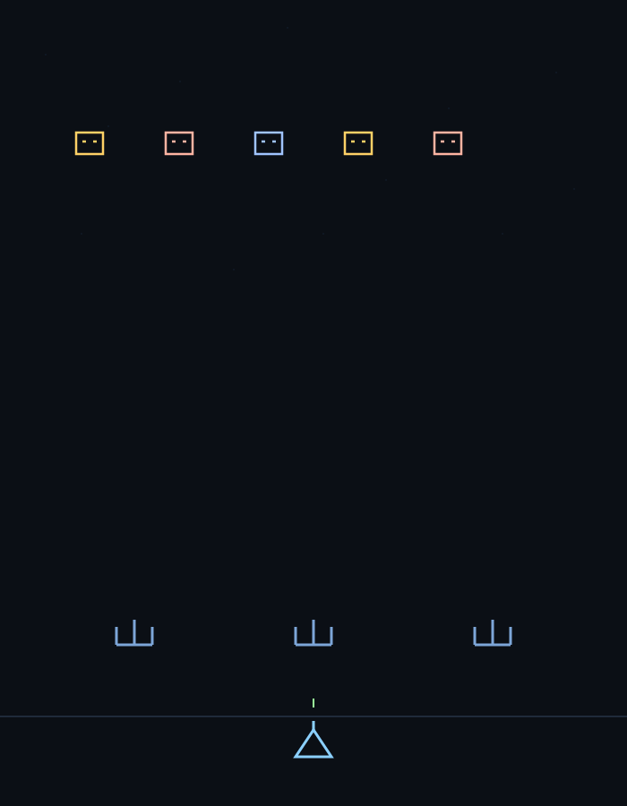

# Stick Arcade (Space Invaders + Asteroids) — .NET 9 Static Host

  
  
  
  
  
  </img>
  
  
  

A minimal Space Invaders–style game rendered with stick geometry on an HTML5 canvas. The game is written in plain JavaScript with zero dependencies and is hosted by a minimal ASP.NET Core app (net9.0) that serves the static files from wwwroot.

## Project Layout

- SpaceInvaders.sln — Visual Studio/Rider solution
- SpaceInvaders.Web/ — ASP.NET Core minimal app (net9.0)
  - Program.cs — minimal hosting pipeline with static files
  - SpaceInvaders.Web.csproj — project file
  - wwwroot/
    - index.html — game page
    - main.js — game logic
- Asteroids.Web/ — New ASP.NET Core minimal app (net9.0) hosting a stick-graphics Asteroids game in the same style
  - Program.cs — minimal hosting pipeline with static files
  - Asteroids.Web.csproj — project file
  - wwwroot/
    - index.html — game page
    - main.js — game logic
    - gameExports.js — pure helpers/entities for unit tests
- index.html, main.js — copies of the same game at repo root (can be opened directly in a browser if you prefer; the Web project serves the copies under wwwroot)

## Requirements

- .NET 9 SDK (https://dotnet.microsoft.com/)
  - Verify with: `dotnet --version` (should report 9.x)
- Any modern browser (for playing the game)
- Optional: JetBrains Rider / Visual Studio 2022 for running/debugging the web app

## Run the games (via .NET host)

From the repository root:

1) Restore and build (optional; run will build automatically):
   - `dotnet build`

2) Run one of the ASP.NET Core apps:
   - Space Invaders: `dotnet run --project SpaceInvaders.Web`
   - Asteroids: `dotnet run --project Asteroids.Web`

3) Open your browser:
   - Navigate to the URL printed in the console, typically `http://localhost:5000` (or `https://localhost:5001`).
   - Health check endpoint: `http://localhost:5000/health` should return `OK`.

Each app serves index.html by default and static assets from its own wwwroot directory.

## Alternative: Open the static files directly

If you don’t want to run the .NET host, you can:
- Open SpaceInvaders.Web/wwwroot/index.html directly in your browser, or
- Open the root-level index.html (duplicate). Note that some browsers restrict local file access; for the best experience use the .NET host above or a simple static server.

## Gameplay & Controls (high level)

Space Invaders:
- Move: Left/Right Arrow or A/D
- Shoot: Spacebar
- Restart after game over: Click the Restart button or press R
- Goal: Clear waves of stick-geometry invaders. Watch out for enemy shots and use the stick bunkers.

Asteroids:
- Rotate: Left/Right Arrow or A/D
- Thrust: Up Arrow or W
- Shoot: Spacebar
- Restart after game over: Click Restart or press R
- Goal: Clear all asteroids; larger rocks split into smaller ones.

## Tech Notes

- Rendering: HTML5 Canvas 2D
- No frameworks or libraries required for the game logic
- Hosting: ASP.NET Core minimal API with static files middleware (UseDefaultFiles + UseStaticFiles)
- Target framework: net9.0

## Testing

- JavaScript unit tests use Vitest.
- Added tests for both Space Invaders utilities and the new Asteroids project.
- Run locally:
  - Install Node.js 20+.
  - npm ci
  - npm test

Test files:
- tests/game.test.js — exercises SpaceInvaders.Web/wwwroot/gameExports.js
- tests/asteroids.test.js — exercises Asteroids.Web/wwwroot/gameExports.js

CI runs these tests on every push/PR before building the .NET host.

## Build, Publish, Deploy

- Build: `dotnet build`
- Publish (framework-dependent example):
  - `dotnet publish SpaceInvaders.Web -c Release -o out`
  - Run from output: `dotnet out/SpaceInvaders.Web.dll`

To create a self-contained single-folder publish for Windows x64, for example:
- `dotnet publish SpaceInvaders.Web -c Release -o out-win-x64 -r win-x64 --self-contained false`

Adjust the runtime identifier (RID) and self-contained setting as needed.

## Troubleshooting

- dotnet not found or wrong version: Install the .NET 9 SDK; re-open your shell so PATH updates apply.
- Port already in use: ASP.NET Core may choose an alternate port. Use the exact URL printed in the console, or set `ASPNETCORE_URLS=http://localhost:5005` before running.
- Blank page from file://: Some browsers block local script execution. Prefer running through the .NET host.

## Contributing

See CONTRIBUTING.md. Please also read CODE_OF_CONDUCT.md.

## Security

See SECURITY.md for how to report vulnerabilities.

## License

This project is licensed under the MIT License — see the LICENSE file for details.
